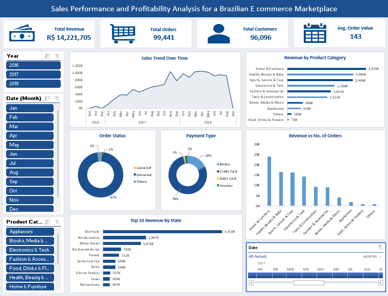

# Sales Performance and Profitability Analysis for a Brazilian E commerce Marketplace

This project provides insights into sales performance, customer behavior, and profitability across a Brazilian e-commerce marketplace. It helps answer key business questions such as:

* What are the total revenue, total orders, total customers, and average order value?
* How do sales trends change over time (monthly/yearly)?
* Which product categories generate the most revenue?
* How do payment methods and order status impact overall performance?
* Which states contribute the highest revenue?
* Is there a relationship between revenue and number of orders by category?

## Features

- **Slicers for Interactive Filtering:**
    * Year (2016, 2017, 2018)
    * Month (Jan–Dec)
    * Product Category

- **Key Performance Indicators (KPI Cards):**
    * Total Revenue
    * Total Orders
    * Total Customers
    * Average Order Value

- **Visualizations:**
    * Line Chart – Sales Trend Over Time (Revenue by Month/Year)
    * Horizontal Bar Chart – Revenue by Product Category
    * Donut Chart – Order Status Distribution (Delivered, Canceled, Others)
    * Donut Chart – Payment Type Distribution (Credit Card, Debit Card, Boleto, Voucher)
    * Bar Chart – Revenue vs. Number of Orders by Category
    * Horizontal Bar Chart – Top 10 Revenue by State
    * Date Timeline – Interactive Monthly Filtering

## Dashboard
Access the Brazilian Ecommerce Dashboard 

