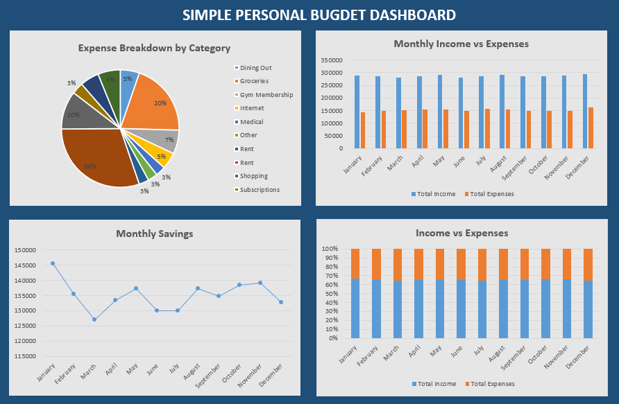

# Personal Budget Tracker

A simple monthly budget tracker built in Excel using tables, formulas, and charts. Tracks income, expenses, and savings by month.

## Features
- Raw data table
- Monthly summary with savings
- Charts for income vs expenses, and category breakdown

## Demo

## Usage
1. Enter transactions in the `Monthly_Tracker` sheet
2. See summary and charts update automatically
