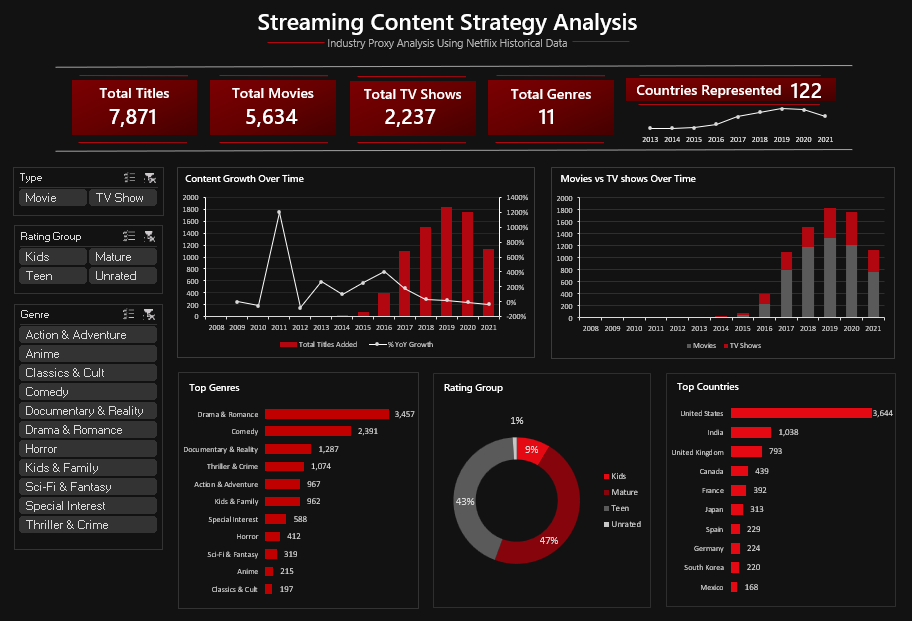

# 📊 Streaming Content Strategy Analysis (Excel Dashboard)

## 📌 Project Overview

This project is an interactive Excel-based Business Intelligence dashboard analyzing historical Netflix content data to uncover strategic insights about streaming content distribution and growth trends.

The dashboard answers key strategic questions:

- How has content production grown over time?
- What is the distribution between Movies and TV Shows?
- Which genres dominate the platform?
- What rating groups are most common?
- Which countries produce the most content?

Built entirely in Microsoft Excel using Power Pivot and DAX, this project demonstrates advanced dashboard development and analytical modeling skills.

---

## 🖥 Dashboard Preview



### 🔢 KPI Summary

- **Total Titles:** 7,871  
- **Total Movies:** 5,634  
- **Total TV Shows:** 2,237  
- **Total Genres:** 11  
- **Countries Represented:** 122  

All KPIs dynamically update based on slicer interaction.

---

## 📂 Dataset

**Source:** Netflix Historical Content Dataset  
**Total Records:** 7,871  
**Countries Represented:** 122  
**Primary Genres:** 11  

### Key Columns:
- ID
- Title
- Type (Movie / TV Show)
- Date Added
- Genre
- Rating Group
- Country
- Duration

---

## 🧹 Data Cleaning & Preparation

The dataset was cleaned and structured before loading into the Data Model.

### Cleaning Steps:
- Removed duplicate IDs
- Standardized content type values
- Grouped genres into 11 main categories
- Created rating groups (Kids, Teen, Mature, Unrated)
- Converted date fields to proper format
- Built structured Excel Tables
- Loaded data into Power Pivot Data Model

---

## ⚙ Technical Implementation

### 🔹 Tools & Features Used

- Excel Pivot Tables
- Power Pivot (Data Model)
- DAX Measures
- Slicers
- KPI Cards
- Combo Charts
- Donut & Bar Charts
- Custom Dark Theme Dashboard Layout

---

## 📐 Key DAX Measures

### Distinct Titles
```DAX
Distinct Titles :=
DISTINCTCOUNT(Analysis_File[ID])
```

### % Movies (Filter-Context Controlled)
```DAX
% Movies :=
DIVIDE(
    CALCULATE(
        DISTINCTCOUNT(Analysis_File[ID]),
        Analysis_File[Type] = "Movie"
    ),
    CALCULATE(
        DISTINCTCOUNT(Analysis_File[ID]),
        ALL(Analysis_File[Type])
    )
)
```

This ensures KPI percentages remain stable even when slicers are applied.

---

## 📊 Dashboard Components

### 1️⃣ Content Growth Over Time
- Annual content additions
- Year-over-Year growth %
- Identifies peak expansion periods

### 2️⃣ Movies vs TV Shows Over Time
- Visual comparison of content type growth
- Highlights long-term strategy shifts

### 3️⃣ Top Genres
- Drama & Romance leads
- Comedy and Documentary follow
- Clear long-tail genre distribution

### 4️⃣ Rating Group Distribution
- Mature content dominates
- Teen content follows closely
- Kids and Unrated form smaller segments

### 5️⃣ Top Producing Countries
- United States leads significantly
- India second
- UK, Canada, France, Japan among top contributors

---

## 📈 Key Insights

- Content production accelerated significantly after 2015
- Movies dominate the overall catalog size
- Mature-rated content represents nearly half of all titles
- A small number of countries drive the majority of content
- Genre concentration suggests strategic investment clustering

---

## 🎯 Business Value

This dashboard supports:

- Content acquisition strategy
- Market expansion analysis
- Genre investment decisions
- Rating-based audience targeting
- Regional production evaluation

---

## 🛠 Skills Demonstrated

- Advanced Excel Dashboard Design
- Power Pivot Data Modeling
- DAX Calculations
- Filter Context Management
- KPI Engineering
- Data Visualization
- Business Insight Extraction
- Analytical Storytelling

---

## ▶ How to Use

1. Download the Excel file
2. Open using Excel 2019 or later
3. Enable content if prompted
4. Use slicers to filter by:
   - Type
   - Rating Group
   - Genre

All visuals and KPIs update dynamically.

---

## 🚀 Future Improvements

- Add forecasting models
- Integrate additional streaming datasets
- Build Power BI version
- Add dynamic ranking filters
- Include profitability proxy metrics

---

## 📌 Project Purpose

This project demonstrates the ability to:

- Transform raw data into executive-level insights
- Build interactive dashboards in Excel
- Apply DAX filter context control properly
- Translate data into strategic recommendations

Part of a Data Analytics portfolio showcasing practical Business Intelligence solutions using Excel.